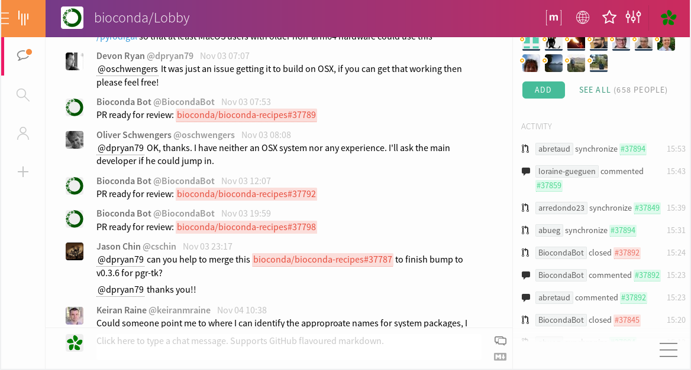

layout: true
<div class="scilife-logo"></div>
<div class="nbis-logo"></div>

---

class: center, middle

# Managing packages with Conda

### Marcel Martin

2022-11-17

Slides: https://github.com/NBISweden/workshop-conda


```{r Setup, echo = FALSE, message = FALSE}
# Knitr setup
#knitr::opts_chunk$set(message = FALSE,
#                      warning = FALSE)

```

---

# Part I

- Conda introduction (refresher)

--
- Bioconda

--
- Mamba

--
- Managing environments

--
- Sharing environments

--
- Conda and workflow managers

--
- Creating recipes


--

# Part II

- Exercises

--
- Creating recipes step by step

--
- Contributing a recipe to Bioconda

---

# Conda: a .green[package], .green[dependency], and .green[environment] manager

--
* Think `apt`, `brew`, `pip`, `yum` etc., but with focus on data science

--
* Supports Linux, macOS, Windows

--
* Packages come pre-compiled

--
* On Linux, they work on most distributions

--
* Packages are hosted centrally at [anaconda.org](https://anaconda.org/)

--
* Users can contribute their own packages via *channels* (think YouTube)

--
* Most important for us (apart from `defaults`):
  - The [conda-forge](https://conda-forge.org/) channel
  - The [Bioconda](https://bioconda.github.io/) channel
* Both are community-driven

---

# Terms

* .green[Conda]: The package manager
* .green[`conda`]: The command-line program
* .green[Anaconda, Inc.] (previously Continuum Analytics, Inc.): The company
* .green[Anaconda]: A distribution of many data-science packages managed by `conda`
* .green[miniconda]: A much smaller distribution that only contains `conda`
* .green[Mamba]: A faster, drop-in replacement for `conda`
* .green[Bioconda]: A bioinformatics-focused channel for Conda packages
* .green[conda-forge]: A community-driven channel for everything else

???

* boa, miniforge, mambaforge, micromamba, ...

---

# Using Conda on your laptop

* Download [Miniconda](https://docs.conda.io/en/latest/miniconda.html) and install it:

```bash
$ curl -sO https://repo.anaconda.com/miniconda/Miniconda3-latest-Linux-x86_64.sh
$ bash Miniconda3-latest-Linux-x86_64.sh

Welcome to Miniconda3 py39_4.12.0
[...]
```

* Set up the [Bioconda](https://bioconda.github.io/) channel:
```bash
conda config --add channels defaults
conda config --add channels bioconda
conda config --add channels conda-forge
conda config --set channel_priority strict
```

---

# Some Bioconda pitfalls

* The recommended settings have changed over the years:
  - Strict channel priority
  - Channel order (re-run the `conda config` commands to correct it)
  - The `r` channel was dropped (easiest is to remove it manually from `~/.condarc`)

--
* *Not* configuring the channels and using `-c bioconda` sometimes works, but may fail mysteriously
  - You *also* need `-c conda-forge` and you need them in the right order.

--
* Bioconda does not produce Windows packages (but conda-forge does)
  - However, platform-independent packages can still be installed on Windows

---

# Using Conda on Rackham and Bianca

For `conda` to be permanently available, do this *once* and log in again:

```bash
module load conda
conda init  # Modifies your ~/.bashrc
conda config --set auto_activate_base false
```

Or run `module load conda` and `source conda_init.sh` every time you want to use
`conda`.

* Bioconda, conda-forge etc. are pre-configured.
* They point to *local mirrors*
* This works even on Bianca

---

# Conda is sometimes slow

* Conda installs a package and all required dependencies, observing constraints on the version.

    *Example:*
    - A workflow needs tools `x` and `y`.
    - `x` requires `snakemake`
    - Recent `snakemake` versions require `python>=3.7`
    - Tool `y` requires `python<=3.6`
    - → The dependency resolver needs to find an older `snakemake` version
      still compatible with Python 3.6.

--
* Solving which package versions satisfy all requirements is an NP-complete problem

--
* For channels with many packages (conda-forge) and/or packages with many dependencies,
  dependency resolution can take *hours*.

---

# Mamba to the rescue


* [Mamba](https://mamba.readthedocs.io/en/latest/) is a (much) faster replacement for `conda`

--

* Same command-line interface as `conda` (in most cases)

--

* Install it (from `conda-forge`):
```bash
conda install -n base mamba
```

--
* Mamba is *already installed on Rackham*

--
* The [conda-libmamba-solver project](https://github.com/conda/conda-libmamba-solver) is working on integrating the Mamba solver into regular Conda


???

* Mamba does not necessarily give the same results as the Conda solver
* Sometimes it picks too old package versions, solution is to explicitly specify which minimum versions you want

---

# Conda environment – basics

* Anything installed by Conda is put into a *Conda environment*.
  - A single environment contains a consistent set of packages
    (compatible with each other)
  - Different environments are independent of each other

--

* The default environment is called `base`
  - It contains Conda itself and its dependencies such as Python

--

* The base environment is the only one that cannot easily be deleted and re-created, so keep it clean

  - Best to use it only for Conda-related tools (`mamba`, `conda-build` etc.)

--

* For anything else, create a new environment.

---

# Working with environments

* Example: Create an environment mapped `mapping` and install Samtools and Bowtie2 into it:

  ```bash
  mamba create -n mapping samtools bowtie2
  ```

* To use the software in an environment, **activate** it:

  ```bash
  $ conda activate mapping
  $ samtools --version
  samtools 1.15.1
  ```

--

* To install a package into an existing environment:

  ```bash
  conda install -n mapping bwa=0.7.17
  ```

* Or to install into the currently activated environment:

  ```bash
  conda install bwa=0.7.17
  ```

* You can use `=`, `>=`, `<=` to constrain package versions

--

* Find packages by searching [anaconda.org](https://anaconda.org) or with `conda search` (or `mamba search`)

---

# Treat Conda environments as ephemeral

* To test a new tool, install it into a fresh Conda environment.
  Then delete the environment to uninstall.

  ```bash
  conda env remove -n mapping
  ```

* To find out when the bug you’re seeing in a tool was introduced,
  install older versions into a temporary environment

* If your project’s environment got messed up, just delete it and start over.

---

# More about environments

* Environments are just directories within your Conda installation directory
  (`~/miniconda/envs/mapping` or similar)
  - Activating an environment adds its `bin/` directory to your `$PATH`

--

## Environments on Rackham

* Conda uses (hard-)links to safe disk space
* ... but these still take up inodes
* Thus, on Rackham, preferably create environments within project directories using `-p`:
  ```bash
  mamba create -p /proj/snic.../nobackup/mycondaenv r-base
  ```

---

# Persisting and sharing environments

* **Environment files** specify how to create an environment.
* Example `environment.yaml`:

  ```yaml
  name: bwa
  channels:
    - conda-forge
    - bioconda
    - defaults
  dependencies:
    - bwa=0.7.17
  ```

--

* To create the environment, run:

  ```bash
  mamba env create -f environment.yaml  # Note: "env create", not "create"
  ```

--

* The YAML file can be written manually or you let Conda generate it from an existing environment:

  ```bash
  conda env export --no-builds [--from-history] > environment.yaml
  ```
  - `--no-builds` is recommended in the [Bioconda FAQ](http://bioconda.github.io/faqs.html#why-shouldn-t-i-include-build-numbers-in-my-environment-yamls)

---

# Categories of environment files

* Environment files can be *abstract* or *concrete* or anything in between.

--

* **Abstract dependencies:** List only `pysam` and Conda will pick a suitable version
  for it and its dependencies.
  - Good at development time and when you develop something that needs to be
    installable alongside other tools.
  - Not reproducible. If a dependency is updated, your tool or workflow may produce different results.

--

* **Concrete dependencies:** List `pysam=0.19.1` and *all dependencies and their versions*.
  - This is what `conda env export` creates.
  - Reproducible.
  - Very unflexible. Installing another tool into the environment likely leads
    to conflicts.
  - Probably platform-specific. You need one concrete `environment.yaml` for
    each platform you support.

---

# Abstract or concrete?

* For some projects, using both abstract *and* concrete makes sense:
  - The abstract dependencies define what your software depends on
  - The concrete dependencies (one file for each platform) are used for your tests (CI)
  - The concrete environments are generated from the abstract one.

---

# More ways to create reproducible environment specifications

```bash
conda list --export > environment.txt
```

```
# This file may be used to create an environment using:
# $ conda create --name <env> --file <this file>
# platform: linux-64
...
bwidget=1.9.14=ha770c72_1
bzip2=1.0.8=h7f98852_4
...
```

--

```bash
conda list --explicit > explicit.txt
```

```
...
@EXPLICIT
...
https://conda.anaconda.org/conda-forge/linux-64/ca-certificates-2022.9.24-ha878542_0.tar.bz2
https://conda.anaconda.org/conda-forge/noarch/font-ttf-dejavu-sans-mono-2.37-hab24e00_0.tar.bz2
...
```

* Exactly reproduces environments (on one platform)
* It is very fast because Conda no longer resolves dependencies
* Recreating the environment can fail when files are removed from anaconda.org

---

class: center, middle

.Huge[Using Conda with workflow managers]


---

# Using Conda with Snakemake: Option one

## A single environment for the entire workflow

* Write an environment file (`environment.yaml`) that includes **all tools used by the workflow**:
```python
name: best-practice-smk
channels:
  - conda-forge
  - bioconda
  - default
dependencies:
  - snakemake=6.8.0   # ← Snakemake is part of the environment
...
  - multiqc=1.11   # ← Version numbers for reproducibility
  - samtools=1.13
```

--
* Create the environment, activate it and run the workflow within it:

  ```bash
  conda env create -f environment.yml
  conda activate best-practice-smk
  snakemake
  ```

.tiny[source: [best practice example](https://github.com/NBISweden/snakemake_best_practice)]

---
# Using Conda with Snakemake: Option two

## Rule-specific environments

You can let Snakemake create and activate Conda environments for you.

--
1. Create the environment file, such as `envs/bwa.yaml` (`envs/` is best practice)

--
1. Add the `conda:` directive to the rule:
```python
rule create_bwa_index:
    output: ...
    input: ...
    conda: "envs/bwa.yaml"  # ← Path to environment YAML file
    shell:
        "bwa index {input}"
```
--
1. Run `snakemake --use-conda`

--

* Snakemake creates the environment for you and re-uses it next time
* If the YAML file changes, the environment is re-created
* `conda:` does not work if you use `run:` (instead of `shell:` or `script:`)


.tiny[modified from: [best practice example](https://github.com/NBISweden/snakemake_best_practice)]

---

# Nextflow and Conda

* [Nextflow also has native Conda support](https://www.nextflow.io/docs/latest/conda.html)
* Set `conda.enabled = true` in your pipeline configuration
* Specify either Conda package names:
```groovy
process foo {
  conda 'bwa samtools multiqc'

  ...
}
```
* ... or the path to an environment file:
```groovy
process foo {
  conda 'path/to/my/environment.yaml'

  ...
}
```

---

# R Studio

```bash
mamba create -n rstudio rstudio-desktop
conda activate rstudio
rstudio
```
Install R libraries:
```bash
mamba install -n rstudio bioconductor-dada2 r-tidyverse
```

From within R Studio:
```R
>>> system("mamba install -y bioconductor-dada2 r-tidyverse")
```
(Don’t forget the `-y`.)


---

class: center, middle

.Huge[Writing recipes for creating Conda packages]

---

# Basics for package authors

* Conda packages are `.tar.bz2` or `.conda` files
* They are created with `conda build` from a `meta.yaml` file
  - It contains the packaging instructions
  - It is also called the “recipe”

---

# Recipes

- The recipe `meta.yaml` is in YAML format
- It contains metadata, installation instructions and lists of dependencies
- To create your own, start with an existing one
- Other files are sometimes necessary:
    * Patches
    * Build scripts
    * Test data

---

# Example

    package:
      name: igdiscover
      version: 0.12
    source:
      url: https://pypi.io/<shortened>/igdiscover-0.12.tar.gz
      sha256: dc0d139a5da<shortened>020eaa92121f7c36
    build:
      number: 0
      script: python -m pip install --no-deps --ignore-installed .
    requirements:
      host:
        - python >=3.6
        - pip
      run:
        - python >=3.6
        - igblast 1.10
    test:
      commands:
        - igdiscover --help
    about:
      home: https://igdiscover.se/
      license: MIT
      summary: 'Analyze antibody repertoires and discover new V genes'


---

# The package section

... defines the package’s name and version:


    
    

    package:
      name: "{{ name|lower }}"
      version: "{{ version }}"

* Recipes are actually Jinja2 templates
* Jinja2 allows to set and use variables

---

# The source section

... tells Conda which files to download

    source:
      url: https://pypi.io/packages/source/i/igdiscover/igdiscover-{{ version }}.tar.gz
      sha256: dc0d139a5da7e672dff1dae7a1d64fcdf7a0a7379e5bca61020eaa92121f7c36

* Download the package once manually, then use `sha256sum` to compute its SHA256 checksum
* The checksum ensures that the files are ok
* Conda unpacks the source automatically during the build

---

# The build section

    build:
      number: 0
      script: python -m pip install --no-deps --ignore-installed .

* `script` describes what one would run to install the package
* If possible, copy this from another recipe
* Put more complicated build scripts in a `build.sh` file instead
* The build number is usually 0
* If the recipe is updated, but the program version is the same, increase the build number by 1

---

# The requirements section

... lists the dependencies

    requirements:
      host:
        - python >=3.6
        - pip
      run:
        - python >=3.6
        - igblast 1.10

* `build`: Build tools (e.g. Autotools, CMake)
* `host`: Target-specific dependencies (shared libraries, Python)
* `run`: Runtime dependencies (installed on user’s system along with package)

---

# The test section

... describes how to test the package after it has been built

    test:
      commands:
        - igdiscover --help

* This is usually just a “smoke test”:
  Running the tool with `--version` or `--help` to ensure it does not crash
* To run the tests, Conda creates a fresh environment and installs the
  newly-built package into it

---

# The about section

This should be straightforward:

    about:
      home: https://igdiscover.se/
      license: MIT
      summary: 'Analyze antibody repertoires'
      description: |
        Longer description of the package, maybe
        across multiple lines.

---

class: center, middle

.Huge[Contributing a recipe to Bioconda]


---

# Contributing to


* Read <https://bioconda.github.io/contributor/>
* Join the chat at <https://gitter.im/bioconda/Lobby>



---

# Bioconda specifics

- Bioconda recipes are at<br/>
  <https://github.com/bioconda/bioconda-recipes>
- CI services are used for automation:
    * Checking recipes for common problems (linting)
    * Building packages
    * Testing them
    * Uploading to Anaconda.org

---

# Preparation

- Fork and clone `bioconda-recipes`

<video width="800px" autoplay muted="true" loop="true">
<source src="fork.webm" type="video/webm">
</video>

---

# Steps for adding a recipe

- Add `recipes/mypackagename/meta.yaml` in your fork
- Make it work locally
- Open a PR (read the instructions)
- Wait for tests to run
- Update until all tests pass
- Ask the BiocondaBot to add the "please review & merge" label
- Make other requested changes
- Wait for the reviews

---

# Becoming a Bioconda member

- In your PR, ping @bioconda/core and tell them you’d like to become a member.
- As a member, you can open branches in the original repo and don’t have to work
  in a fork (remember to delete your fork).

---

# The Bioconda bot

- Automatically opens PRs for version bumps (of Python packages, for example)
- Accepts various commands in PRs by writing `@BiocondaBot please ...`
